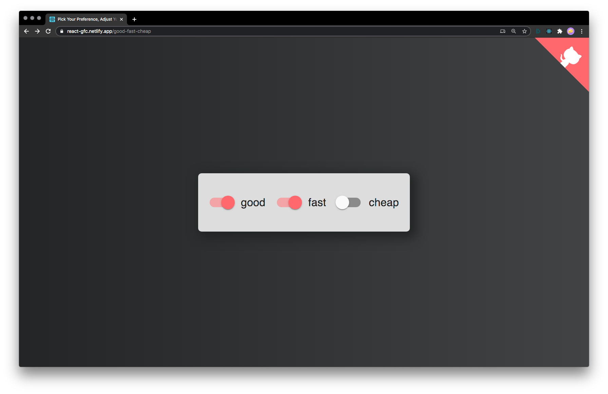
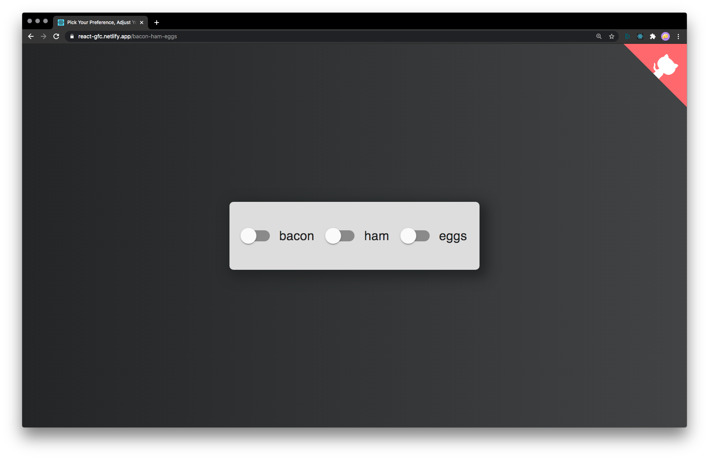

# react-gfc

Three interdependent switches in a functional react component emulating the classic triple constraint.

[View live site](https://react-gfc.netlify.app/)

## Custom Labels

Labels can be changed by modifying the URL:

`https://react-gfc.netlify.app/bacon-ham-eggs`

Will result in a bacon, a ham and an eggs label. If no custom label names are provided the component defaults to `good-fast-cheap`.

## Built With

- [Create React App](https://create-react-app.dev/docs/getting-started/)
- [Material-UI](https://material-ui.com/)
- [React Router](https://reactrouter.com/)

## Deployed On

- [Netlify](https://www.netlify.com/)

## License

Distributed under the MIT License.

## Contact

[Marius Kroh](https://www.mariuskroh.de)

Project Link: [https://github.com/mariuskroh/react-gfc](https://github.com/github_username/repo)
